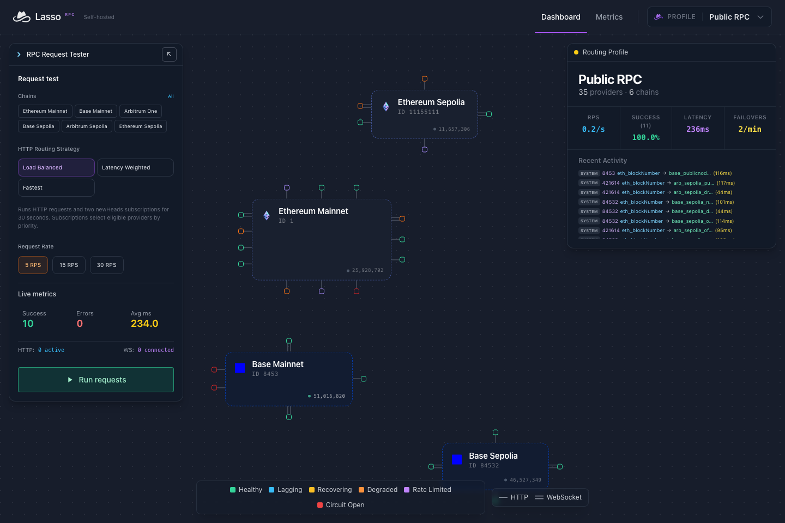

### Resilient Ethereum RPC over HTTP and WebSocket

[](docs/API_REFERENCE.md)
[](https://t.me/+79pFERTlZPIzZTZh)
[](https://x.com/lassoRPC)
[](https://www.apache.org/licenses/LICENSE-2.0)
[](https://github.com/jaxernst/lasso-rpc/releases)
[](https://elixir-lang.org)

Lasso is a multi-chain Ethereum JSON-RPC proxy with health checks, retries,
failover, and a live dashboard. Route requests across your own nodes and RPC
providers by pointing your client at Lasso's URL.

Run it on your own infrastructure with YAML configuration. The included public
providers let you try it without API keys.

[Quick Start](#quick-start) · [Configuration](#configuration) ·
[Endpoints](#endpoints) · [Troubleshooting](#troubleshooting) ·
[Run from source](#run-from-source) · [Documentation](#documentation)

## Features

- **Routing control:** `fastest`, `load-balanced`, `latency-weighted`, and direct provider routes.
- **Method-aware measurements:** latency tracked per provider, RPC method, and transport.
- **Provider resilience:** circuit breakers, retries, and failover based on health and declared capabilities.
- **WebSocket subscriptions:** multiplexed `newHeads` and `logs`, with bounded recovery and HTTP gap-filling.
- **YAML profiles:** separate chain, provider, and routing configurations; identical upstreams can share runtime state.
- **Live dashboard:** provider topology, health, latency, routing activity, and an HTTP/WebSocket request tester.
- **Optional clustering:** aggregate observability across nodes while each node routes independently.

## Quick Start

### Docker Compose (recommended)

You need Docker with the Compose plugin, curl, and OpenSSL. Start in an empty directory:

```bash
mkdir lasso && cd lasso
curl --fail --location https://github.com/jaxernst/lasso-rpc/releases/download/v0.3.5/compose.yml --output compose.yml
(umask 077; printf 'SECRET_KEY_BASE=%s\nRELEASE_COOKIE=%s\n' "$(openssl rand -hex 64)" "$(openssl rand -hex 32)" > .env)
docker compose up -d --wait
curl --fail http://localhost:4000/api/health
```

Open **<http://localhost:4000/dashboard>**. The prebuilt image supports Linux AMD64
and ARM64 and requires no source checkout or application build tools.

Compose binds localhost and keeps profiles and history in a named volume.
Preserve `.env` across restarts. `docker compose down` stops Lasso and retains its
data; adding `--volumes` deletes it. See [Deployment](docs/DEPLOYMENT.md#docker)
for image verification, custom providers, upgrades, and rollback.

Lasso has no built-in client authentication or incoming RPC quotas. Protect
externally accessible RPC, metrics, and dashboard endpoints with your network or
reverse proxy. The dashboard tester sends real upstream requests.

## Try It

Request the latest Ethereum block number:

```bash
curl --fail-with-body --silent --show-error http://localhost:4000/rpc/ethereum \
  -H 'Content-Type: application/json' \
  -d '{"jsonrpc":"2.0","method":"eth_blockNumber","params":[],"id":1}'
```

A successful response contains a hexadecimal block number; the value changes:

```json
{"jsonrpc":"2.0","id":1,"result":"0x18ba3fb"}
```

The health endpoint checks the application. This RPC request also exercises an
upstream provider. Public providers have their own availability and rate limits.

For WebSocket subscriptions, use the dashboard tester or run
[`wscat`](https://github.com/websockets/wscat) with Node.js and npm:

```bash
npx --yes wscat -c ws://localhost:4000/ws/rpc/ethereum
```

At its `>` prompt, send:

```json
{"jsonrpc":"2.0","method":"eth_subscribe","params":["newHeads"],"id":1}
```

Expect a subscription ID followed by `eth_subscription` notifications as blocks
arrive. Press Ctrl+C to disconnect.

To inspect routing decisions, add `?include_meta=headers` to an HTTP request URL
and `-i` to curl. See the [API reference](docs/API_REFERENCE.md#observability-metadata)
for metadata fields and error responses.



## Configuration

Profiles are YAML files. In Docker, follow the
[host-mounted profile setup](docs/DEPLOYMENT.md#custom-profiles-and-credentials);
in a source checkout, edit `config/profiles/`. Keep a valid `public.yml` and match
each additional filename to its `slug`.

For example, save this as `my-app.yml` in your profiles directory:

```yaml
---
name: My App
slug: my-app
---
chains:
  ethereum:
    chain_id: 1
    providers:
      - id: publicnode
        url: https://ethereum-rpc.publicnode.com
        ws_url: wss://ethereum-rpc.publicnode.com
      - id: drpc
        url: https://eth.drpc.org
        ws_url: wss://eth.drpc.org
```

This example uses public endpoints for both HTTP and subscriptions. Replace them
with your own upstreams as needed. Provider URLs and authentication headers
support `${ENV_VAR}` substitution; unresolved variables reject the configuration.
See [provider credentials](docs/CONFIGURATION.md#provider-credentials) and the
[bundled profile](config/profiles/public.yml) for capability and limit settings.

After adding a profile, recreate the container:

```bash
docker compose up -d --force-recreate --wait
```

Then use `http://localhost:4000/rpc/profile/my-app/ethereum` or
`ws://localhost:4000/ws/rpc/profile/my-app/ethereum`.
For new profiles and YAML edits, use
[configuration reload](docs/DEPLOYMENT.md#custom-profiles-and-credentials).
A failed reload preserves the active configuration. Environment or mount changes
require container recreation.

Profiles are configuration boundaries, not access controls. The dashboard reads
them from YAML; edit the files to create or change profiles. Profile `rps_limit`
controls the dashboard tester and does not rate-limit incoming RPC traffic.

## Endpoints

| Route | HTTP (POST) | WebSocket |
|-------|-------------|-----------|
| Default | `/rpc/:chain` | `/ws/rpc/:chain` |
| Strategy | `/rpc/:strategy/:chain` | `/ws/rpc/:strategy/:chain` |
| Provider override | `/rpc/provider/:provider_id/:chain` | `/ws/rpc/provider/:provider_id/:chain` |
| Profile | `/rpc/profile/:profile/:chain` | `/ws/rpc/profile/:profile/:chain` |

The default strategy is `load-balanced`. Strategy routes accept `fastest`,
`load-balanced`, or `latency-weighted`. Profiles also support strategy and provider
routes; see the [API reference](docs/API_REFERENCE.md).

Use a configured chain name such as `ethereum` or its decimal EIP-155 ID, `1`.
Routes without a profile use `public`; `default` remains an alias for `public`.
Subscription recovery depends on eligible WebSocket upstreams and configured
[recovery limits](docs/CONFIGURATION.md#websocket).

## Troubleshooting

Start with container status and recent logs:

```bash
docker compose ps -a
docker compose logs --tail=100 lasso
```

| Symptom | Check |
|---------|-------|
| Container fails to start | Check logs for missing environment variables or invalid YAML. Keep `public.yml`; profile filenames must match their slugs. |
| Port 4000 is in use | Set `LASSO_PORT=4001` in `.env`, run `docker compose up -d --wait`, and use port 4001 in URLs. |
| Health passes but RPC fails | Check provider status in the dashboard, upstream credentials, and network access. Health does not verify upstream availability. |
| Profile changes have no effect | Reload existing profiles on each node. After adding a profile or changing `.env` or mounts, run `docker compose up -d --force-recreate --wait`. |

## Run from source

For development, use Elixir 1.18.4 and Erlang/OTP 28 (the CI versions), plus
Node.js 18 or newer for asset compilation:

```bash
git clone https://github.com/jaxernst/lasso-rpc
cd lasso-rpc
mix deps.get
mix assets.setup
mix assets.build
mix phx.server
```

Open <http://localhost:4000/dashboard>. See [Contributing](CONTRIBUTING.md) for tests
and code quality checks. To build a production container from the checkout, set
`SECRET_KEY_BASE` and run `docker compose up --build -d`, or use `./run-docker.sh`.
The checkout's Compose file builds locally; the release attachment pulls the image.

## How it works

Lasso filters providers by method, transport, capabilities, and health, ranks
eligible candidates using the selected strategy, then executes with bounded
retries and failover. Measurements feed subsequent routing and the dashboard.
Elixir/OTP supervision manages provider connections; ETS holds routing and
benchmark state. See [Architecture](docs/ARCHITECTURE.md) for the runtime design.

A single node works standalone. For multiple regions, your DNS or load balancer
routes clients to a Lasso node. Optional [clustering](docs/DEPLOYMENT.md#multi-node-clustering)
shares observability; each node routes from its local measurements. Cluster setup
requires named Erlang nodes, a shared cookie, DNS discovery, and private connectivity.

## Documentation

- [Configuration](docs/CONFIGURATION.md) — YAML, provider credentials, capabilities, and strategies
- [API reference](docs/API_REFERENCE.md) — routes, metadata, subscriptions, and errors
- [Deployment](docs/DEPLOYMENT.md) — containers, persistence, upgrades, and clustering
- [Observability](docs/OBSERVABILITY.md) — logs and metrics
- [RPC standards](docs/RPC_STANDARDS.md) — compatibility and supported methods
- [Testing](docs/TESTING.md) — verification commands
- [Changelog](CHANGELOG.md) — release history

## Contributing

See [Contributing](CONTRIBUTING.md) for development setup and checks. Report bugs
through [GitHub issues](https://github.com/jaxernst/lasso-rpc/issues); discuss major
changes there before opening a pull request.

## Security

See the [Security Policy](SECURITY.md) for deployment guidance and private
vulnerability reporting.

## License: Apache-2.0

[Apache License 2.0](LICENSE.md). Built by [jaxer.eth](https://farcaster.xyz/jaxer.eth).
