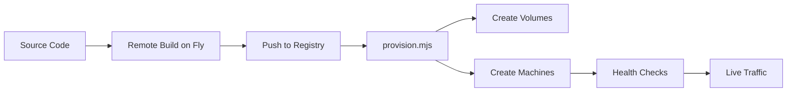

# Lasso RPC Deployment Guide

This guide covers deploying Lasso RPC to Fly.io, from basic staging deployments to advanced multi-region production setups with zero-downtime blue/green deployments.

## Table of Contents

1. [Prerequisites](#prerequisites)
2. [Quick Start: First Staging Deployment](#quick-start-first-staging-deployment)
3. [Fly.io CLI Basics](#flyio-cli-basics)
4. [Debugging Deployments](#debugging-deployments)
5. [Advanced: Multi-Region Production Deployment](#advanced-multi-region-production-deployment)
6. [Blue/Green Deployments](#bluegreen-deployments)
7. [Troubleshooting](#troubleshooting)
8. [Reference](#reference)

---

## Prerequisites

### 1. Install Fly CLI

```bash
# macOS/Linux
curl -L https://fly.io/install.sh | sh

# Verify installation
flyctl version
```

### 2. Authenticate with Fly.io

```bash
# Login (opens browser)
flyctl auth login

# Verify authentication
flyctl auth whoami
```

### 3. Create a Build Token

Lasso RPC requires a **build token** to use Fly's remote builder (Depot) for amd64 builds. This avoids cross-compilation issues on Apple Silicon.

1. Go to https://fly.io/dashboard
2. Navigate to your organization settings → Tokens
3. Click "Create token"
4. **Select scope**: "Build" (or "Deploy" which includes build)
5. Copy the token (starts with `FlyV1 fm2_...`)

---

## Quick Start: First Staging Deployment

### Step 1: Set Up Environment Variables

Create a deployment environment file:

```bash
# Copy the template
cp .env.deploy.example .env.deploy

# Edit with your values
vim .env.deploy
```

Required variables in `.env.deploy`:

```bash
# Fly API Token (build token from prerequisites)
export FLY_API_TOKEN="FlyV1 fm2_..."

# App Configuration
export FLY_APP_NAME="lasso-staging"
export REGIONS="iad"              # Single region for staging
export MACHINE_COUNT="2"
export VOLUME_SIZE_GB="3"         # used only if STATEFUL=true
export STATEFUL="false"           # stateless by default (set to "true" to enable volumes)

# Phoenix Secret (auto-generated if not set)
# export SECRET_KEY_BASE="$(mix phx.gen.secret)"

# Provider API Keys (optional - can be added later)
# export INFURA_API_KEY=""
# export ALCHEMY_API_KEY=""

# Rollout tuning (optional)
# export DRAIN_DELAY_SECS="15"     # grace delay between destroying blue machines
```

### Step 2: Load Environment and Deploy

```bash
# Load environment variables
source .env.deploy

# Run the deployment script
./deployment/deploy-staging.sh
```

This script will:

1. Build the Docker image on Fly's remote amd64 builder
2. Push the image to Fly's registry
3. Create the app and machines
4. Wait for health checks (when implemented)

### Step 3: Verify Deployment

```bash
# Check app status
flyctl status --app lasso-staging

# View logs
flyctl logs --app lasso-staging

# Check machine details
flyctl machines list --app lasso-staging

# Test the application
curl https://lasso-staging.fly.dev/api/status
```

---

## Fly.io CLI Basics

### Essential Commands

#### App Management

```bash
# List all your apps
flyctl apps list

# View app details
flyctl status --app <app-name>

# View app configuration
flyctl config show --app <app-name>

# Destroy an app (careful!)
flyctl apps destroy <app-name>
```

#### Machine Management

```bash
# List machines
flyctl machines list --app <app-name>

# View specific machine
flyctl machine status <machine-id> --app <app-name>

# SSH into a machine
flyctl ssh console --app <app-name>
flyctl ssh console --app <app-name> --machine <machine-id>

# Update machine resources
flyctl machine update <machine-id> --memory 2048 --app <app-name> --yes

# Restart a machine
flyctl machine restart <machine-id> --app <app-name>

# Stop a machine
flyctl machine stop <machine-id> --app <app-name>

# Start a machine
flyctl machine start <machine-id> --app <app-name>
```

#### Secrets Management

```bash
# List secrets (values hidden)
flyctl secrets list --app <app-name>

# Set a secret
flyctl secrets set SECRET_KEY_BASE=<value> --app <app-name>

# Set multiple secrets
flyctl secrets set KEY1=val1 KEY2=val2 --app <app-name>

# Remove a secret
flyctl secrets unset SECRET_KEY_BASE --app <app-name>

# Import secrets from file
flyctl secrets import --app <app-name> < secrets.txt
```

#### Volume Management

```bash
# List volumes
flyctl volumes list --app <app-name>

# Create a volume
flyctl volumes create data_iad --size 10 --region iad --app <app-name>

# Show volume details
flyctl volumes show <volume-id> --app <app-name>

# Destroy a volume (careful - data loss!)
flyctl volumes destroy <volume-id> --app <app-name>
```

#### Deployment

```bash
# Deploy using fly.toml
flyctl deploy --app <app-name>

# Deploy with remote builder (recommended for Apple Silicon)
flyctl deploy --app <app-name> --remote-only

# Deploy with immediate strategy (updates all machines at once)
flyctl deploy --app <app-name> --strategy immediate

# Deploy specific image
flyctl deploy --app <app-name> --image registry.fly.io/<app>:tag
```

---

## Debugging Deployments

### Viewing Logs

```bash
# Stream live logs
flyctl logs --app <app-name>

# Show last N lines and exit
flyctl logs --app <app-name> --no-tail | tail -50

# Filter by machine
flyctl logs --app <app-name> --machine <machine-id>

# Filter by region
flyctl logs --app <app-name> --region iad

# JSON output for parsing
flyctl logs --app <app-name> --json
```

### Inspecting Machine State

```bash
# Get detailed machine status
flyctl machine status <machine-id> --app <app-name>

# Check machine events
flyctl machines list --app <app-name>

# View machine configuration
flyctl machine status <machine-id> --app <app-name> --json | jq .config
```

### SSH Debugging

```bash
# SSH into a running machine
flyctl ssh console --app <app-name>

# Run a specific command
flyctl ssh console --app <app-name> --command "ls -la /app"

# Check if chains.yml exists
flyctl ssh console --app <app-name> --command "cat /app/config/chains.yml"

# View Erlang/Elixir release
flyctl ssh console --app <app-name> --command "/app/bin/lasso remote"
```

### Common Debugging Scenarios

#### 1. App Crashes on Boot

```bash
# Check recent logs for error messages
flyctl logs --app <app-name> --no-tail | grep -i error

# Common issues:
# - Missing SECRET_KEY_BASE
# - Missing chains.yml configuration
# - Out of memory (OOM)
# - Port binding issues
```

#### 2. Out of Memory (OOM) Errors

```bash
# Check for OOM in logs
flyctl logs --app <app-name> --no-tail | grep -i "out of memory"

# Increase machine memory
flyctl machine update <machine-id> --memory 2048 --app <app-name> --yes
```

#### 3. Configuration Issues

```bash
# Verify secrets are set
flyctl secrets list --app <app-name>

# Check environment variables in running machine
flyctl ssh console --app <app-name> --command "env | grep LASSO"
```

#### 4. Network/Port Issues

```bash
# Verify services configuration
flyctl config show --app <app-name>

# Test connectivity
curl -v https://<app-name>.fly.dev/

# Check if Phoenix is listening on correct port
flyctl ssh console --app <app-name> --command "netstat -tlnp | grep 4000"
```

---

## Advanced: Multi-Region Production Deployment

For production deployments with multiple regions, volumes, and proper stateful management, use the `provision.mjs` script.

### Architecture Overview

- **Regions**: Multiple regions for low latency globally (e.g., iad, sea, ams, cdg)
- **Machines**: 2+ machines per region for HA
- **Volumes**: Per-region persistent storage for chains.yml, snapshots, and backups
- **Zero-downtime**: Blue/green deployment strategy

### Step 1: Configure Production Environment

Create `deployment/.env.production`:

```bash
# Production Build Token
export FLY_API_TOKEN="FlyV1 fm2_..."

# App Configuration
export FLY_APP_NAME="lasso-prod"
export REGIONS="iad,sea,ams,cdg"  # Multi-region
export MACHINE_COUNT="2"          # 2 machines per region
export VOLUME_SIZE_GB="10"        # Larger for production

# Required Secrets
export SECRET_KEY_BASE="$(mix phx.gen.secret)"
export INFURA_API_KEY="your-key"
export ALCHEMY_API_KEY="your-key"

# Optional: Additional secrets as JSON
# export SECRETS_JSON='{"OTHER_KEY":"value"}'
```

### Step 2: Build and Push Image

```bash
# Load environment
source deployment/.env.production

# Authenticate Docker to Fly registry
flyctl auth docker

# Build on Fly's remote builder (avoids cross-compilation)
TAG="prod-$(date +%Y%m%d-%H%M%S)"
export IMAGE_REF="registry.fly.io/${FLY_APP_NAME}:${TAG}"

flyctl deploy \
  --app "$FLY_APP_NAME" \
  --image-label "$TAG" \
  --build-only \
  --remote-only

echo "Built image: $IMAGE_REF"
```

### Step 3: Provision Infrastructure

```bash
# Run infrastructure-as-code provisioning
node deployment/provision.mjs
```

This creates:

- App if it doesn't exist
- Secrets (SECRET*KEY_BASE, provider keys, LASSO*\* paths)
- Volumes in each region (data_iad, data_sea, data_ams, data_cdg)
- 2 machines per region with volume mounts
- HTTP/HTTPS services with WebSocket support
- Health checks on /api/health

### Step 4: Seed Configuration

The entrypoint script automatically seeds `/data/chains.yml` from `/app/config/chains.yml` on first boot. If you need to manually seed:

```bash
# SSH into a machine in each region
flyctl ssh console --app lasso-prod --region iad

# Check if chains.yml exists
ls -la /data/chains.yml

# If missing, seed it
cp /app/config/chains.yml /data/chains.yml
exit

# Restart the machine
flyctl machine restart <machine-id> --app lasso-prod
```

### Step 5: Verify Multi-Region Deployment

```bash
# Check all machines
flyctl machines list --app lasso-prod

# Should see 2 machines per region (8 total for 4 regions)
# REGION: iad (2), sea (2), ams (2), cdg (2)

# Check volumes
flyctl volumes list --app lasso-prod

# Verify health in each region
for region in iad sea ams cdg; do
  echo "Testing region: $region"
  curl -s --resolve "lasso-prod.fly.dev:443:$(flyctl ips list --app lasso-prod --json | jq -r .[0].address)" \
    https://lasso-prod.fly.dev/api/status | head -3
done
```

---

## Blue/Green Deployments

Blue/green deployments allow zero-downtime updates by creating new machines (green) alongside old ones (blue), then switching traffic.

### Using the Roll Script

The `roll.mjs` script automates blue/green deployments:

```bash
# Build new image
source deployment/.env.production
TAG="prod-$(date +%Y%m%d-%H%M%S)"
export IMAGE_REF="registry.fly.io/${FLY_APP_NAME}:${TAG}"

flyctl deploy --app "$FLY_APP_NAME" --image-label "$TAG" --build-only --remote-only

# Run blue/green rollout
node deployment/roll.mjs
```

### Manual Blue/Green Process

If you need to do it manually:

```bash
# 1. List current machines (blue)
flyctl machines list --app lasso-prod

# 2. For each machine in a region:
REGION="iad"
OLD_MACHINE="<blue-machine-id>"

# 3. Create new machine (green) with new image
flyctl machine clone $OLD_MACHINE \
  --region $REGION \
  --app lasso-prod \
  --image registry.fly.io/lasso-prod:new-tag

# 4. Wait for health check
NEW_MACHINE="<new-machine-id>"
flyctl machine status $NEW_MACHINE --app lasso-prod --wait

# 5. Stop old machine (blue)
flyctl machine stop $OLD_MACHINE --app lasso-prod

# 6. Verify new machine is serving traffic
curl https://lasso-prod.fly.dev/api/status

# 7. Destroy old machine after confirming
flyctl machine destroy $OLD_MACHINE --app lasso-prod
```

### WebSocket Considerations

For long-lived WebSocket connections:

1. **Overlap capacity**: Create green machines before removing blue
2. **Drain gradually**: Stop blue machines one at a time
3. **Client reconnects**: Ensure clients have reconnection logic
4. **Grace period**: Wait 30-60s between stopping machines

```bash
# Graceful WebSocket rollout
# 1. Create all green machines first (N → 2N capacity)
for machine in $(flyctl machines list --app lasso-prod --json | jq -r .[].id); do
  flyctl machine clone $machine --app lasso-prod --image $NEW_IMAGE
done

# 2. Wait for all green machines to be healthy
sleep 30

# 3. Stop blue machines one by one
for old_machine in $BLUE_MACHINES; do
  flyctl machine stop $old_machine --app lasso-prod
  sleep 30  # Allow WebSocket clients to reconnect
done

# 4. Clean up blue machines
for old_machine in $BLUE_MACHINES; do
  flyctl machine destroy $old_machine --app lasso-prod
done
```

---

## Troubleshooting

### Issue: Cross-Compilation Errors on Apple Silicon

**Symptom**: `Module.put_attribute/3` error or segfaults during local Docker build

**Solution**: Use Fly's remote builder with a build token (already configured in deploy scripts)

```bash
# Ensure you have a build token in FLY_API_TOKEN
flyctl deploy --remote-only --app <app-name>
```

### Issue: Out of Memory (OOM)

**Symptom**: Logs show "Out of memory: Killed process" or "beam.smp"

**Solution**: Increase machine memory

```bash
# Update all machines to 2GB
for machine in $(flyctl machines list --app <app> --json | jq -r .[].id); do
  flyctl machine update $machine --memory 2048 --app <app> --yes
done
```

### Issue: Missing `/data/chains.yml`

**Symptom**: App crashes with "Configuration file not found: /data/chains.yml"

**Solution**: Either:

1. Remove `LASSO_CHAINS_PATH` secret to use bundled config
2. SSH in and manually seed the file

```bash
# Option 1: Use bundled config
flyctl secrets unset LASSO_CHAINS_PATH --app <app>

# Option 2: Seed manually
flyctl ssh console --app <app> --command "cp /app/config/chains.yml /data/chains.yml"
```

### Issue: Cannot Connect to WebSocket Providers

**Symptom**: Logs show WebSocket connection failures

**Solution**: Check firewall/egress rules and verify provider URLs

```bash
# Test connectivity from machine
flyctl ssh console --app <app> --command "curl -v wss://ethereum.publicnode.com"

# Check provider status in logs
flyctl logs --app <app> | grep -i "connected to websocket"
```

### Issue: Machines in "stopped" State

**Symptom**: `flyctl status` shows machines as "stopped"

**Solution**: Check logs for crash cause, then restart

```bash
# View recent crash logs
flyctl logs --app <app> --no-tail | tail -100

# Start machine
flyctl machine start <machine-id> --app <app>
```

### Issue: Build Token Authorization Error

**Symptom**: "Not authorized to manage this organization::feature"

**Solution**: Create a build token (not regular token) in Fly dashboard

1. Go to https://fly.io/dashboard → Organization → Tokens
2. Create token with **Build** scope
3. Update `FLY_API_TOKEN` in `.env.deploy`

---

## Reference

### Project Structure

```
deployment/
├── BUILD_SOLUTIONS.md          # Cross-compilation solutions
├── DEPLOYMENT_GUIDE.md          # This file
├── deploy-staging.sh            # Simple staging deployment script
├── provision.mjs                # Infrastructure-as-code provisioning
├── roll.mjs                     # Blue/green rollout script
├── entrypoint.sh                # Container entrypoint (seeds chains.yml)
├── .env.deploy.example          # Environment template
└── .env.production              # Production environment (gitignored)
```

### Key Configuration Files

- **`fly.toml`**: Minimal config for remote builds
- **`Dockerfile`**: Multi-stage build with Debian Bullseye
- **`config/chains.yml`**: Chain configuration (copied to /data in production)
- **`mix.exs`**: Excludes wx/observer from production

### Deployment Workflow



### Machine Configuration Defaults

- **CPU**: 1 shared CPU
- **Memory**: 1024 MB (increased from 512 MB)
- **Platform**: linux/amd64
- **Restart Policy**: always
- **Stop Signal**: SIGINT with 30s timeout
- **Concurrency**: Connections-based (soft: 500, hard: 1000)

### Health Check Configuration

Configure health checks in `provision.mjs`:

```javascript
checks: {
  http: {
    type: "http",
    port: 4000,
    path: "/api/health",
    interval: "10s",
    timeout: "2s",
    grace_period: "15s",
    method: "GET",
  },
}
```

**Note**: Currently `/api/health` endpoint is not implemented in the application.

### Useful Resources

- [Fly.io Documentation](https://fly.io/docs/)
- [Fly Machines API](https://fly.io/docs/machines/api/)
- [Phoenix Deployment Guide](https://hexdocs.pm/phoenix/deployment.html)
- [Elixir Releases](https://hexdocs.pm/mix/Mix.Tasks.Release.html)

---

## Quick Reference Commands

```bash
# View app status
flyctl status -a <app>

# Stream logs
flyctl logs -a <app>

# List machines
flyctl machines list -a <app>

# SSH into app
flyctl ssh console -a <app>

# Update secret
flyctl secrets set KEY=value -a <app>

# Restart machine
flyctl machine restart <id> -a <app>

# Deploy new version
source .env.deploy && ./deployment/deploy-staging.sh
```

---

**Last Updated**: 2025-10-09
**Maintained By**: Lasso RPC Team
